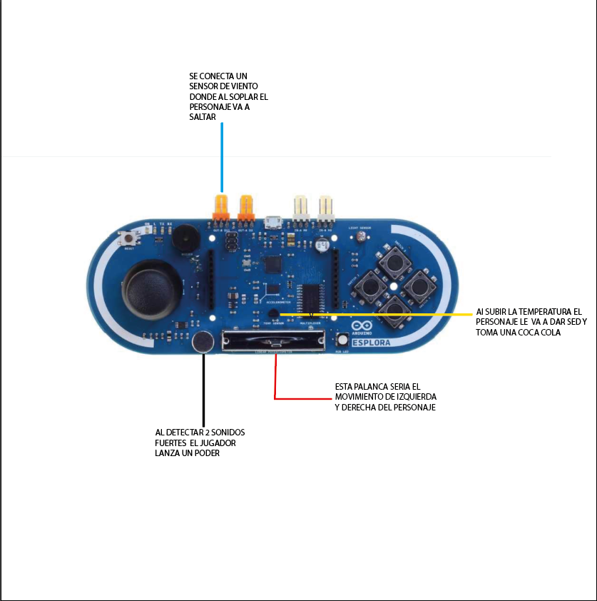

# Mario-poder-sed-salto




Juego interactivo de mario que funciona con arduino explora y sensor de aire 
¡Perfecto! Te preparo un **PRD (Product Requirements Document)** para un proyecto usando Arduino Explora con esa mecánica tan creativa que me planteas. 🚀

---

# PRD - Juego interactivo con Arduino Explora y sensores externos

---

## 1. Nombre del proyecto

**“El desafío del poder, la sed y el salto”**

---

## 2. Objetivo

Crear un juego interactivo en el que el jugador debe reaccionar a distintos estímulos sensoriales: voz, temperatura, viento y joystick para realizar acciones específicas.

---

## 3. Descripción general

El sistema usa el Arduino Explora con sus sensores internos y un sensor de viento externo para crear una experiencia de juego donde:

* Al detectar 2 sonidos fuertes (sensor de voz), el jugador "lanza un poder".
* Si la temperatura sube (sensor de temperatura), el jugador siente sed y debe "tomar Coca-Cola".
* El jugador puede moverse de izquierda a derecha con la palanca (joystick).
* Si se detecta viento (sensor de viento externo), el jugador salta.

---

## 4. Requerimientos funcionales

| ID  | Requerimiento                                                                  | Prioridad | Detalles                                                                                    |
| --- | ------------------------------------------------------------------------------ | --------- | ------------------------------------------------------------------------------------------- |
| RF1 | Detectar cuando el sensor de voz detecta 2 sonidos fuertes consecutivos        | Alta      | El sensor debe contar 2 eventos de voz para activar el "poder".                             |
| RF2 | Detectar aumento de temperatura para activar estado de “sed”                   | Alta      | Al superar un umbral de temperatura, se activa alerta de sed y acción de "tomar Coca-Cola". |
| RF3 | Mover jugador de izquierda a derecha con joystick                              | Alta      | Lectura analógica del joystick para mover un indicador o sprite en pantalla.                |
| RF4 | Detectar ráfaga de viento con sensor externo para activar salto                | Alta      | Al detectar viento (pulsos o nivel analógico) el jugador debe saltar.                       |
| RF5 | Mostrar estado actual (poder, sed, posición, salto) por LEDs o pantalla serial | Media     | Indicadores visuales o salida serial para monitoreo del estado del juego.                   |

---

## 5. Requerimientos no funcionales

| ID   | Requerimiento             | Prioridad | Detalles                                              |
| ---- | ------------------------- | --------- | ----------------------------------------------------- |
| RNF1 | Respuesta en tiempo real  | Alta      | Las acciones deben ser detectadas y ejecutadas rápido |
| RNF2 | Uso eficiente de recursos | Media     | Código optimizado para Arduino Explora                |
| RNF3 | Seguridad                 | Baja      | No aplica                                             |

---

## 6. Hardware requerido

| Componente          | Descripción                             |
| ------------------- | --------------------------------------- |
| Arduino Explora     | Placa principal con sensores integrados |
| Sensor de viento    | Anemómetro o sensor de viento externo   |
| Buzzer / LEDs       | Indicadores para estados del juego      |
| Cables y protoboard | Para conexiones                         |

---

## 7. Flujo de juego (mecánica)

1. **Inicio**: El sistema inicializa sensores y variables.
2. **Escuchar voz**: Sensor de voz detecta sonidos, si cuenta 2 sonidos fuertes seguidos, lanza el poder (indicar con LED o buzzer).
3. **Medir temperatura**: Si temperatura > umbral, activar sed.

   * Jugador debe "tomar Coca-Cola" (simulado con botón o joystick).
4. **Movimiento**: Joystick mueve jugador de izquierda a derecha (puede ser un LED que se enciende en diferentes posiciones).
5. **Detectar viento**: Sensor externo detecta viento, el jugador salta (indicar con otro LED o buzzer).
6. **Estado visible**: Mostrar por LEDs o Serial los estados actuales.

---

## 8. Ejemplo de valores umbral y parámetros

| Parámetro    | Valor ejemplo                            |
| ------------ | ---------------------------------------- |
| Umbral voz   | 2 sonidos en 3 segundos                  |
| Umbral temp  | > 30 °C                                  |
| Viento       | Pulsos > 3 por segundo                   |
| Movimiento X | Joystick 0 - 1023 mapeado 0-7 posiciones |

---

## 9. Interfaz y salidas

* **LED rojo**: Poder lanzado
* **LED azul**: Sed activa (toma Coca-Cola)
* **LED verde**: Salto activado
* **Serial Monitor**: Estado completo del juego

---

## 10. Consideraciones y extensiones futuras

* Añadir pantalla LCD para interfaz gráfica
* Más niveles con diferentes umbrales y tiempos
* Integrar sonido para feedback
Perfecto, vamos a **precisar y ampliar el PRD** con esa parte importante: la integración con el navegador usando `p5.serialport` y un servidor intermedio en Node.js para leer datos desde Arduino Esplora vía el puerto COM (ej. COM12).

---

## ✍️ Actualización del PRD: **Integración Web con p5.js y Node.js**

---

### 11. **Requerimiento de comunicación serial y visualización web**

---

### ✅ Requerimiento nuevo:

El sistema debe **leer datos en tiempo real desde el Arduino Esplora conectado al PC por un puerto COM (ej. COM12)** y **visualizar el estado del juego en una interfaz web** construida con **p5.js**.

---

### 🔧 Tecnologías requeridas:

| Tecnología                | Uso                                                |
| ------------------------- | -------------------------------------------------- |
| **Arduino Esplora**       | Fuente de datos de sensores                        |
| **Puerto Serial (COM12)** | Canal físico de comunicación Arduino-PC            |
| **Node.js**               | Servidor intermedio para gestionar datos seriales  |
| **p5.serialport**         | Biblioteca para comunicar p5.js con Node.js        |
| **p5.js**                 | Framework para visualizar el juego en el navegador |

---

### 📡 Arquitectura de comunicación:

```plaintext
[Arduino Esplora] --> [Puerto COM (ej. COM12)] --> [Node.js + p5.serialserver] --> [Navegador con p5.js]
```

---

### 📋 Nuevos requerimientos funcionales

| ID  | Requerimiento                                                              | Prioridad | Detalles                                                                               |
| --- | -------------------------------------------------------------------------- | --------- | -------------------------------------------------------------------------------------- |
| RF6 | El sistema debe enviar datos por Serial desde Arduino                      | Alta      | Datos como voz, temperatura, salto, movimiento deben enviarse como strings formateados |
| RF7 | El servidor Node.js debe recibir y retransmitir datos seriales a navegador | Alta      | Usar p5.serialserver o `serialport` y `socket.io` para emitir al frontend              |
| RF8 | El navegador debe visualizar en tiempo real el estado del jugador          | Alta      | Usar p5.js para dibujar elementos como salto, poder, posición, etc.                    |

---

### 🧱 Estructura de los datos enviados por Arduino

Formato ejemplo por línea (JSON o CSV simple):

```plaintext
PODER:1,TEMP:32.4,SEDE:1,SALTO:0,POS:4
```

O si se usa JSON:

```json
{"poder":1,"temp":32.4,"sede":1,"salto":0,"pos":4}
```

---

### 🌐 Estructura del sistema web

1. **Servidor Node.js**

   * Usa `serialport` para leer del puerto COM (ej. COM12)
   * Usa `socket.io` para enviar datos al navegador

2. **Navegador (Frontend con p5.js)**

   * Se conecta a través de WebSockets
   * Dibuja en canvas el estado: salto (salto del sprite), posición, sed (botella), poder (efecto visual)

---

### 🗂️ Estructura del proyecto

```
/arduino/                   --> Código Arduino (ya provisto)
/server/
├── server.js               --> Node.js servidor serial + WebSocket
├── package.json            --> Dependencias
/public/
├── index.html              --> Página web
├── sketch.js               --> p5.js visualización
```

---

### 📌 Notas de implementación

* El servidor debe estar corriendo mientras el Arduino está conectado.
* Asegúrate de tener los permisos adecuados para acceder a COM12.
* Si el Arduino se desconecta, el servidor debe manejar el error de forma segura.

---

¿Te gustaría que te proporcione también los archivos de ejemplo para `server.js` y el `sketch.js` de p5.js?

Puedo armarte el paquete básico de Node + p5 para que solo tengas que instalar y correr. ¿Te interesa?

---


